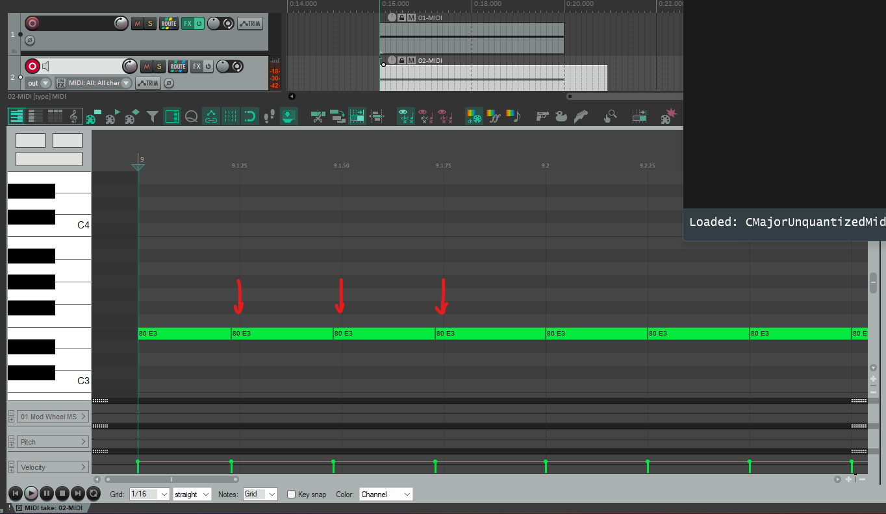

# CMajorUnquantizedMidi

A CMajor patch demo showing that notes generated by using a _wait_ `loop` does not seem to produce well timed `NoteOff`s even though `Tempo.framesPerQuarterNote()` produces consistent results.

> As of version `1.0.2520` of CMajor, this behavior does not manifest when using `ASIO` or `WASAPI` audio drivers. However, when using other drivers, such as `WaveOut`, stuttering occurs when sending out MIDI events.

> As of version `1.0.2537` of CMajor, this has been fixed mainly for the **CMajor VST3 Host**. As for the _generated JUCE plugin version_, the stutter still persists for non-`ASIO` & non-`WASAPI` drivers.

